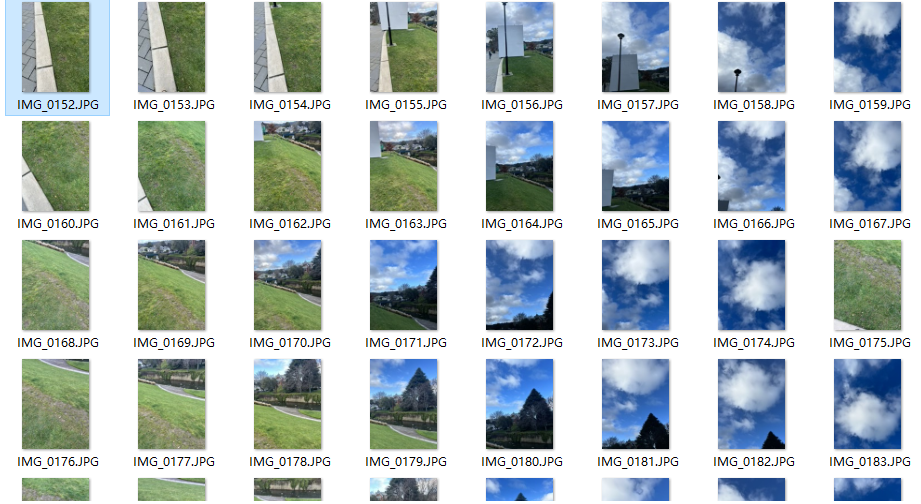

# Info351

# Weekly Blog 

* [Week 1](#WEEK_1)

## WEEK_1 (Jul/10 - Aug/6)

### What have I done: 
In the past few weeks, our main objective has been to acquaint ourselves with various terminologies related to Virtual Reality (VR) and Augmented Reality (AR). We aimed to grasp a clear understanding of what AR, VR, XR, and MR stand for. During our lab sessions, we had the opportunity to learn from Daniel about the principles of creating an engaging game. However, the most significant milestone for us was embarking on our first 3D project. We initiated the process by working on a panoramic skybox, which served as an initial rough draft for our immersive environment. As we progress further, we look forward to refining and expanding our skills in the exciting realms of VR and AR.

In order to make a panoramic, I need to take a lot of photos.

then I need to use the Image Composite Editor to stitch those image, After few steps I got a panoramic image that looks like this.

After I have stitch image, it's time for me to create a real skybox project. In the end my project looks like this: 

### Review 

As beginners in 3D object creation, our progress may initially be slow due to our lack of experience in this field. However, as we delve deeper into learning about 3D technology and its tools, our growth will accelerate rapidly. Embracing the learning process and continually expanding our knowledge will lead us to create more complex and impressive 3D objects with increasing proficiency.

In general, I'm happy with my works so far so good, because this is only a start of our project and I have a lot time to work on it and try my best to improve it, if it failed my satisfiction. 

